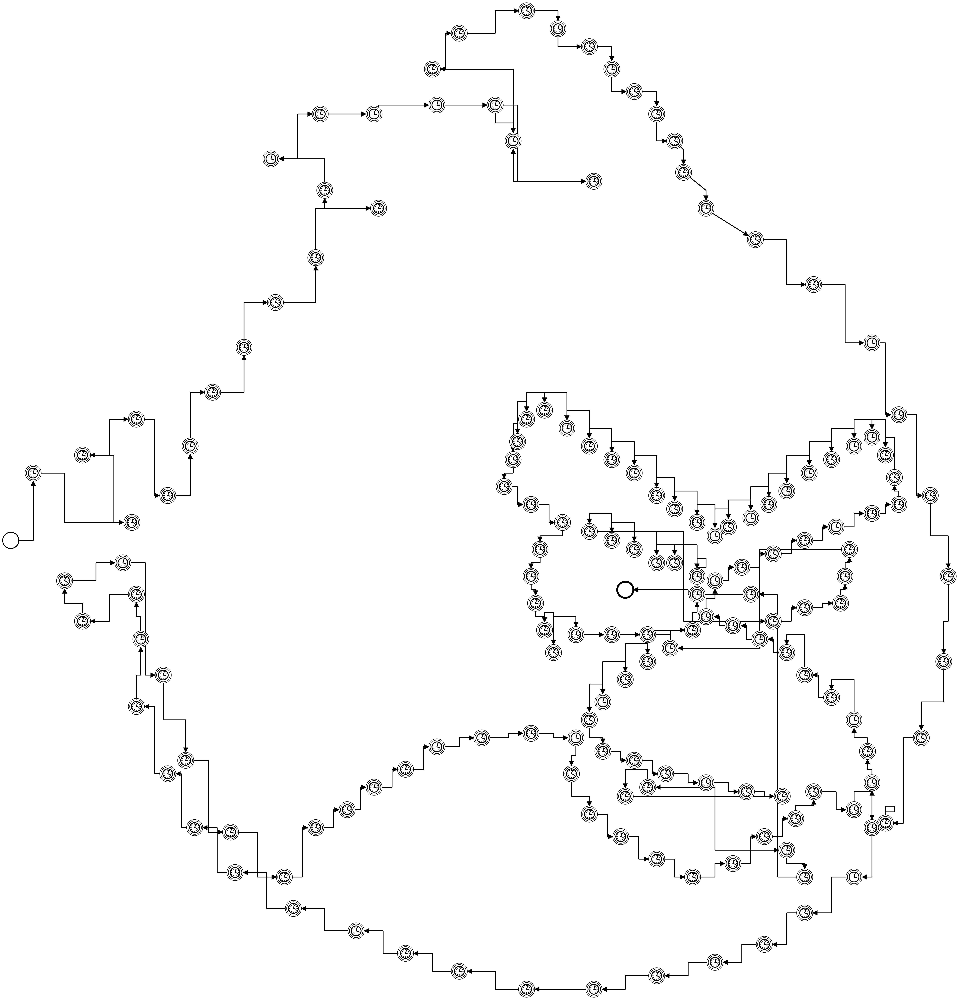
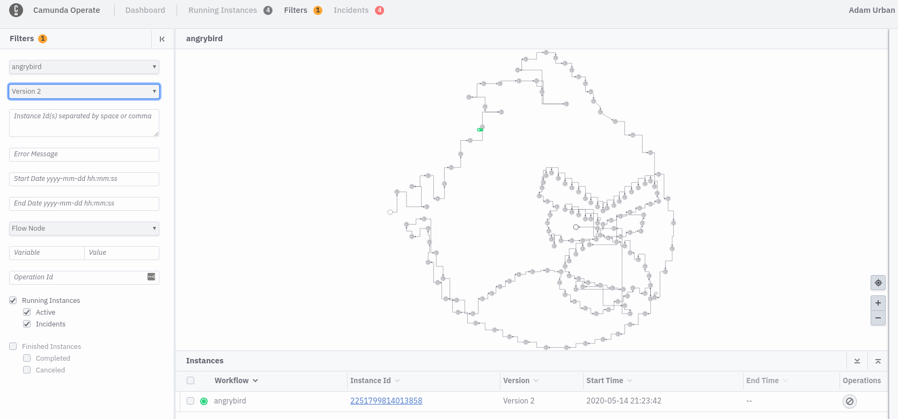
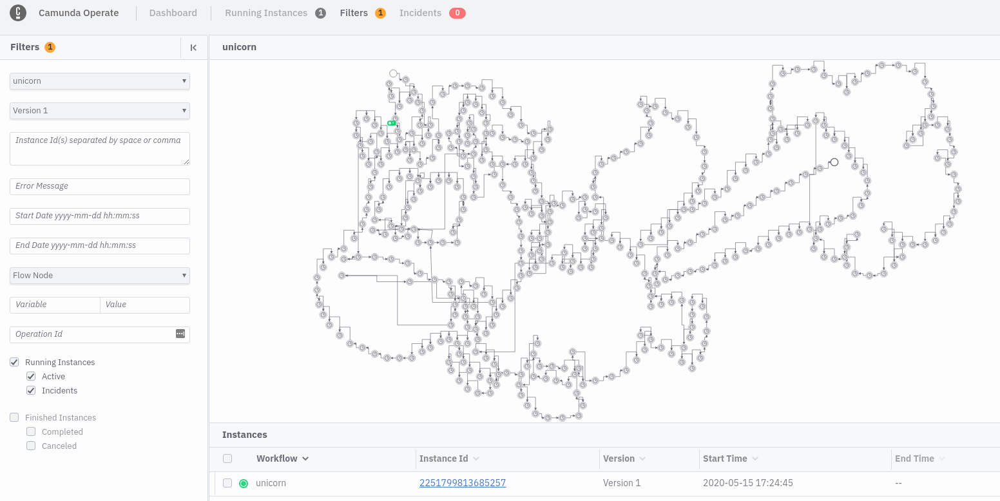

# BPMN Art

Like ascii art but with bpmn models.

This is a little fun project of my kids and me: creating coloring pictures with BPMN models together. First result: angrybirds

## Angrybirds

A `png` representation of the [workflow model](bpmn/angrybirds.bpmn):



## Let it run!

Next level: Running the workflow model - the easiest way to do this is [Camunda Cloud](https://camunda.io/). Once the account is there, create a client, export relevant information as environment variables, install [`zbctl`](https://www.npmjs.com/package/zbctl) and execute the following commands:

Deploy the workflow:

```bash
zbctl deploy bpmn/angrybirds.bpmn
```

Start a workflow instance:

```bash
zbctl create instance angrybird
```

Navigate to operate and watch your instance :)



## Unicorn


### Operate


